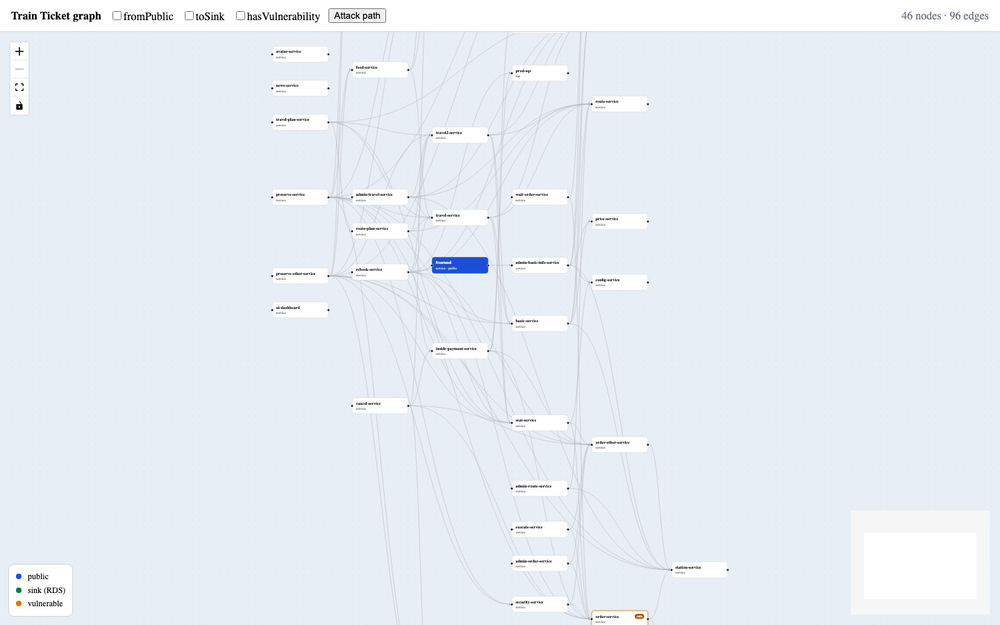

# Train Ticket graph explorer

The assignment asked for a graph query **API** and a short README. The React viewer in `frontend/` is extra — it was not required.

The API returns [React Flow](https://reactflow.dev) JSON. React Flow is the standard format for interactive graphs in React, so the backend speaks that contract: this extra viewer (or any other React Flow client) can render the payload without a second mapping step.

The service loads the Train Ticket microservice graph from JSON, filters **routes** (directed simple paths), and returns a union subgraph with dagre positions.

```
backend/   NestJS API  —  GET /graph
frontend/  Vite + React Flow viewer (extra)
```



## Run

```bash
npm install
npm run setup
npm run dev
```

Open http://localhost:5173. API: http://localhost:3000. `VITE_API_URL` overrides the API origin (`frontend/.env.example`).

- `GET http://localhost:3000/graph` — full graph
- `GET /graph?fromPublic=true&toSink=true&hasVulnerability=true` — attack paths: public service → vulnerable node → RDS. **On the shipped dataset this returns `{ "nodes": [], "edges": [] }`** — see [Result on this dataset](#result-on-this-dataset).

## Filters

All flags are optional booleans (`true` / `false`). Enabled flags are **AND**ed. Unknown names or other values return `400`.

| Flag | Keeps a route if |
| --- | --- |
| `fromPublic` | it starts at a node with `publicExposed: true` |
| `toSink` | it ends at `kind === "rds"` (Postgres). SQS is not a sink |
| `hasVulnerability` | some node on the route has a non-empty `vulnerabilities` array |

No flags: the whole normalized graph. Empty match: `200` with `{ "nodes": [], "edges": [] }`.

A **route** is a directed simple path: it follows edges in the `from → to` direction only, and never repeats a node. The API returns the **union subgraph** of matching routes, not a list of paths.

Why simple paths? Repeating a node would mean revisiting the same component in one "attack path", which is not a meaningful finding, and it makes enumeration infinite the moment the graph contains a cycle. Refusing to revisit a node on the current path bounds every walk by the node count and keeps the search correct if a future version of the dataset does introduce a cycle. The dataset shipped here happens to be a DAG, so this costs nothing today.

The viewer checkboxes map 1:1 to these flags. **Attack path** turns all three on. An empty three-flag result is a banner, not an error.

## Result on this dataset

**The three-flag attack-path query returns an empty graph on `backend/data/train-ticket-be.json`.** That is a fact about the data, not a bug:

- Public nodes are `frontend` and `gateway-service`.
- Following edges forward from them reaches only 8 nodes: `admin-basic-info-service`, `config-service`, `contacts-service`, `price-service`, `station-service`, `train-service`, and the two public nodes themselves.
- The only RDS node, `prod-postgresdb`, has incoming edges from `auth-service` and `order-service` only. Neither is reachable from a public node.

So no directed public → vulnerable → RDS route exists, and the honest answer is `{ "nodes": [], "edges": [] }`. The API does **not** walk edges backwards to manufacture a path; a reverse edge is not an attack path. The fixture in `backend/test/fixtures/small-graph.json` does contain a directed `frontend → order-service → prod-postgresdb` route, and the e2e test asserts the full attack path there.

## Layout

Each node has a dagre `position` (`rankdir: LR`). The API sets React Flow builtins: `input` (public), `output` (RDS), `default` otherwise. Domain fields live in `data`. CORS is enabled for the extra viewer, which uses a custom node type and colours by role.

## Assumptions

- Source file: `backend/data/train-ticket-be.json` (override with `GRAPH_JSON_PATH`).
- `edges[].to` may be a string or an array; it is normalized to an array.
- Edges to missing nodes (`assurance-service`) are dropped with a warning. The process still starts.
- CWE / message mismatches in the source JSON are passed through unchanged.
- This dataset is a DAG — there is no cycle, and `user-service → auth-service` is one-directional. Simple-path DFS is still used so a cycle in future data cannot make the search diverge.

## Tests

```bash
npm test
```
